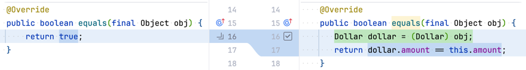

# TDD By Example

## 1장. 다중 통화를 지원하는 Money 객체

### 1.1 todo list 추가하기

### 1.2 add failing test - testMultiplication

```Java

@DisplayName("어떤 금액(주가)을 어떤 수(주식의 수)로 곱한 금액을 결과로 얻을 수 있어야 한다")
@Test
void testMultiplication() {
    Dollar five = new Dollar(5);
    five.times(2);
    assertThat(five.amount).isEqualTo(10);
}
```

### 1.3 add todo list

- 위 테스트 코드의 문제
    - public field 사용
    - 예기치 못한 부작용 발생 가능
    - 금액을 계산하는데 정수형 사용

```Java
/// - [] amount를 private으로 만들기
/// - [] Dollar 부작용(side effect)?
/// - [] Money 반올림?
```

### 1.4 make it compile

### 1.5 make it work - faking

### 1.6 mark done in test list

## 2장. 타락한 객체

### 2.1 add failing case for immutable

- Dollar애 대한 연산을 호출하면 Dollar가 변경되는 것이 이상함
- 다음과 같이 사용할 수 있기를 바람

```Java
void testMultiplication() {
    Dollar five = new Dollar(5);
    five.times(2);
    assertThat(product.amount).isEqualTo(10);
    five.times(3);
    assertThat(product.amount).isEqualTo(15);
}
```

- 이 테스트를 통과할 명쾌한 방법이 떠오르지 않음
- times를 처음 호출한 이후에 five는 더 이상 5가 아님

### 2.2 make test meaningful

- 이 테스트를 통과할 명쾌한 방법이 떠오르지 않는다.
- times()를 처음 호출한 이후에 five는 더 이상 5가 아니다.
- 그렇다면 times()에서 새 로운 객체를 반환하게 만들면 어떨까?

```Java
void testMultiplication() {
    Dollar five = new Dollar(5);
    Dollar product = five.times(2);
    assertThat(product.amount).isEqualTo(10);
    product = five.times(3);
    assertThat(product.amount).isEqualTo(15);
}
```

### 2.3 make it work

### 2.4 mark done in test list

## 3장. 모두를 위한 평등

### 3.1 add todo list

- Value Object가 암시하는 2가지
    - 모든 연산은 새 객체를 반환해야 함
    - equals()를 구현해야 함

### 3.2 add failing test - testEquality

```Java

@Test
void testEquality() {
    assertThat(new Dollar(5)).isEqualTo(new Dollar(5));
}
```

### 3.3 fake it - return true

```Java
public class Dollar {
    ...

    @Override
    public boolean equals(final Object obj) {
        return true;
    }
}
```

### 3.4 triangulate - add one more test

- 삼각측량을 하려면 예제가 두 개 이상 있어야만 코드를 일반화할 수 있음

```Java

@Test
void testEquality() {
    assertThat(new Dollar(5)).isEqualTo(new Dollar(5));
    assertThat(new Dollar(5)).isNotEqualTo(new Dollar(6)); // triangulate를 위한 두번째 예제
}
```

### 3.5 make it work - generalize equality

