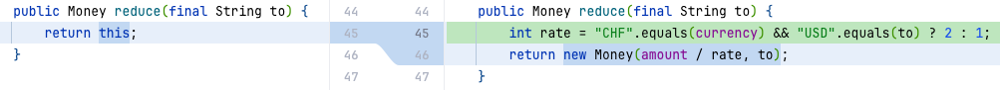

# TDD By Example

## 1장. 다중 통화를 지원하는 Money 객체

### 1.1 todo list 추가하기

### 1.2 add failing test - testMultiplication

```Java

@DisplayName("어떤 금액(주가)을 어떤 수(주식의 수)로 곱한 금액을 결과로 얻을 수 있어야 한다")
@Test
void testMultiplication() {
    Dollar five = new Dollar(5);
    five.times(2);
    assertThat(five.amount).isEqualTo(10);
}
```

### 1.3 add todo list

- 위 테스트 코드의 문제
    - public field 사용
    - 예기치 못한 부작용 발생 가능
    - 금액을 계산하는데 정수형 사용

```Java
/// - [] amount를 private으로 만들기
/// - [] Dollar 부작용(side effect)?
/// - [] Money 반올림?
```

### 1.4 make it compile

### 1.5 make it work - faking

### 1.6 mark done in test list

## 2장. 타락한 객체

### 2.1 add failing case for immutable

- Dollar애 대한 연산을 호출하면 Dollar가 변경되는 것이 이상함
- 다음과 같이 사용할 수 있기를 바람

```Java
void testMultiplication() {
    Dollar five = new Dollar(5);
    five.times(2);
    assertThat(product.amount).isEqualTo(10);
    five.times(3);
    assertThat(product.amount).isEqualTo(15);
}
```

- 이 테스트를 통과할 명쾌한 방법이 떠오르지 않음
- times를 처음 호출한 이후에 five는 더 이상 5가 아님

### 2.2 make test meaningful

- 이 테스트를 통과할 명쾌한 방법이 떠오르지 않는다.
- times()를 처음 호출한 이후에 five는 더 이상 5가 아니다.
- 그렇다면 times()에서 새 로운 객체를 반환하게 만들면 어떨까?

```Java
void testMultiplication() {
    Dollar five = new Dollar(5);
    Dollar product = five.times(2);
    assertThat(product.amount).isEqualTo(10);
    product = five.times(3);
    assertThat(product.amount).isEqualTo(15);
}
```

### 2.3 make it work

### 2.4 mark done in test list

## 3장. 모두를 위한 평등

### 3.1 add todo list

- Value Object가 암시하는 2가지
    - 모든 연산은 새 객체를 반환해야 함
    - equals()를 구현해야 함

### 3.2 add failing test - testEquality

```Java

@Test
void testEquality() {
    assertThat(new Dollar(5)).isEqualTo(new Dollar(5));
}
```

### 3.3 fake it - return true

```Java
public class Dollar {
    ...

    @Override
    public boolean equals(final Object obj) {
        return true;
    }
}
```

### 3.4 triangulate - add one more test

- 삼각측량을 하려면 예제가 두 개 이상 있어야만 코드를 일반화할 수 있음

```Java

@Test
void testEquality() {
    assertThat(new Dollar(5)).isEqualTo(new Dollar(5));
    assertThat(new Dollar(5)).isNotEqualTo(new Dollar(6)); // triangulate를 위한 두번째 예제
}
```

### 3.5 make it work - generalize equality


### 3.6 mark done in test list

### 3.7 add todo list

## 4장. 프라이버시

### 4.1 테스트가 의도(모델 코드)를 반영하도록 수정

- 개념적으로 Dollar.times() 연산은 호출 받은 객체의 값에 인자로 받은 곱수만큼 곱한 값을 갖는 Dollar를 반환해야 함
- 하지만 테스트가 정확히 그것을 말하지는 않음(Dollar가 아니라 int를 반환하는것으로 보임)


### 4.2 inline product

- 임시변수인 product는 더 이상 쓸모가 없어 보임
- 인라인시켜서 가독성을 높이자

### 4.3 make amount to private final

### 4.4 mark done in test list

## 5장. 솔직히 말하자면

### 5.1 add franc multiplication test

- Dollar 테스트를 복사한 후 수정해보자.

```Java

@Test
void testFrancMultiplication() {
    Franc five = new Franc(5);
    assertThat(five.times(2)).isEqualTo(new Franc(10));
    assertThat(five.times(3)).isEqualTo(new Franc(15));
}
```

### 5.2 add Franc by copying Dollar

### 5.3 mark done and add test in test list

## 6장. 돌아온 '모두를 위한 평등'

### 6.1 add super class

- Dollar, Franc의 수퍼클래스로 Money를 추가

### 6.2 pull member up - amount

### 6.3 pull member up - equaLs

### 6.4 remove equals in Franc

### 6.5 mark done and add test in test list

## 7장. 사과와 오렌지

### 7.1 add equality test for franc

- Dollar 케이스를 복붙해서 Franc 케이스를 추가


### 7.2 mark done in test list

### 7.3 add failing case for dollar(5) != franc(5)


### 7.4 make it pass by comparing type


### 7.5 mark done and add test in test list

- 모델 코드에서 클래스를 이런 식으로 사용하는 것은 좀 지저분해 보인다.
- 자바 객체의 용어를 사용하는 것보다 재정 분야에 맞는 용어를 사용하고 싶다.
- 하지만 현재는 통화(curency) 개념 같은 게 없고, 통화 개념을 도입할 충분한 이유가 없어 보이므로 잠시 동안은 이대로 두자.

## 8장. 객체 만들기

### 8.1 return Money in times

- Dollar, Franc의 times 메소드에서 공용 타입인 Money를 반환하도록 변경하여 두 메소드를 보다 비슷하게 만든다.

### 8.2 introduce factory method

- 불필요해 보이는 하위 클래스를 제거하기 하고 싶다.
- 하위 클래스에 대한 직접적인 참조를 없애기 위해 생성자를 팩토리 메소드로 대체한다.
- 절차
    - Replace constructor with factory method
    - pull members up

### 8.3 use base type

### 8.4 add todo in test list

## 9장. 우리가 사는 시간

- time은 시간을 의미하기도 하고, 곱셈을 의미하기도 함

- 할일 목록에서 어떤 것을 하면 귀찮고 불필요한 하위 클래스를 제거하는데 도움이 될까 ?
- 통화 개념을 도입하면 도움이 될 것이다.

### 9.1 add new failing test - testCurrency

- 통화 개념을 도입하면 도움이 될 것이다.

```Java

@Test
void testCurrency() {
    assertThat(Money.dollar(1).currency()).isEqualTo("USD");
    assertThat(Money.franc(1).currency()).isEqualTo("CHF");
}
```

### 9.2 make it work

- add abstract method currency() in Money
- implement currency() in Dollar and Franc

### 9.3 introduce currency field

- 두 클래스의 구현이 최대한 유사해지도록 하기 위해 currency 필드를 추가


### 9.4 pull members up - currency field

- currency 필드를 Money로 옮긴다.
- 베이스 틀래스의 생성자의 인자로 currency를 추가한다.


### 9.5 introduce parameter in c'tor


### 9.6 mark done in test list

## 10장. 흥미로운 시간

- times를 Money로 옮겨서 두 서브 클래스를 없애고 싶다.
- times에서 서로 다른 factory method를 호출하고 있는데, 이를 생성자로 변경하면 동일한 구조를 갖게 할 수 있다.
- 때로는 전진하기 위해 물러서야 할 때도 있는 법

### 10.1 inline factory method to make times look similar

### 10.2 use currency in times instead of constant

### 10.3 return Money in times

- Money의 2개의 abstract method를 구현 or 삭제(times, currency)
- Money 클래스 선언에서 abstract 제거
- Dollar, Franc에서 Money를 반환하도록 수정
- pull members up - times

### 10.4 add Money#toString for debugging

- toString()을 실패하는 테스트의 디버깅을 위해 추가
- 헉! 테스트도 없이 코드를 작성하네? 그래도 되는 건가?
- toString()을 작성하기 전에 테스트를 작성하는 게 맞다.
- 하지만 우린 지금 화면에 나타나는 결과를 보려던 참이다.
- toString()은 디버그 출력에만 쓰이기 때문에 이게 잘못 구현됨으로 인해 얻게 될 리스크가 적다.
- 이미 빨간 막대 상태인데 이 상태에서는 새로운 테스트를 작성하지 않는 게 좋을 것 같다.

```Java
org.opentest4j.AssertionFailedError:
expected:"10 USD (Dollar@5f8edcc5)"
but was:"10 USD (Money@6db9f5a4)"
Expected :10USD
Actual   :10USD
```

- 답은 맞았는데 클래스가 다르다. Franc 대신 Money가 왔다. 문제는 equals() 구현에 있다.

### 10.5 rollback times in Dollar and Franc

- 빨간 막대인 상황에서는 테스트를 추가로 작성하고 싶지 않다.
- 하지만 지금은 실제 모델 코드를 수정하려고 하는 중이고 테스트 없이는 모델 코드를 수정할 수 없다.
- 보수적인 방법을 따르자면 변경된 코드를 되돌려서 다시 초록 막대 상태로 돌아가야 한다.
- 그러고 나서 equals()를 위해 테스트를 고치고 구현 코드를 고칠 수 있게 되고, 그 후에야 원래 하던 일을 다 시 할 수 있다.

### 10.6 add failing test - testDifferentClassEquality

```Java

@Test
void testDifferentClassEquality() {
    assertThat(new Franc(10, "CHF").equals(new Money(10, "CHF"))).isTrue();
}
```

### 10.7 make it pass

- class 대신 currency를 비교하도록 equals()를 수정

### 10.8 remove subclasses

- Dollar, Franc의 times()를 제거
- 생성자만 남은 서브 클래스는 존재의 이유가 없다.
- factory method에서 Money를 반환하도록 수정
- Dollar, Franc를 제거

## 11장. 모든 악의 근원

- 불필요한 코드들을 제거한다.

### 11.1 remove unnecessary test cases


## 12장. 드디어, 더하기

### 12.1 add failing test - testSimpleAddtion

```Java

@Test
void testSimpleAddtion() {
    Money sum = Money.dollar(5).plus(Money.dollar(5));
    assertThat(sum).isEqualTo(Money.dollar(10));
}
```

### 12.2 make it pass

- fake it을 할수도 있지만 어떻게 구현할지 명확하므로 바로 구현함

### 12.3 introduce metaphor - Expression, Bank

- 설계상 가장 어려운 제약은 다중 통화 사용에 대한 내용을 시스템의 나머지 코드에게 숨기고 싶다는 점이다.
- 한 가지 가능한 전략은 모든 내부 값을 참조통화"로 전환하는 것이다.
- 하지만 이 방식으로는 여러 환율을 쓰기가 쉽지 않다.
- 대신, 편하게 여러 환율을 표현할 수 있으면서도 산술 연산 비슷한 표현들을 여전히 산술 연산처럼 다룰 수 있는 해법이 있으면 좋을 것 같다.
- 객체가 우리를 구해줄 것이다. 가지고 있는 객체가 우리가 원하는 방식으로 동작하지 않을 경우엔 그 객체와 외부 프로토콜이 같으면서 내부 구현은 다른 새로운 객체(imposter, 타인을 사칭하는 사기꾼)를 만들
  수 있다.
- 해법은 Money와 비슷하게 동작하지만 사실은 두 Money의 합을 나타내는 객체를 만드는 것이다.
- 나는 이 아이디어를 설명하기 위한 몇 가지 다른 메타포를 생각해봤다.
- 한 가지는 Money의 합을 마치 지갑처럼 취급하는 것이다.
    - 한 지갑에는 금액과 통화가 다른 여러 화폐들이 들어갈 수 있다.
    - 또 다른 메타포는 `(2 + 3) x 5`와 같은 수식이다.
        - 우리 경우엔 `($2 + 3 CHF) x 5`가 되겠지만.
        - 이렇게 하면 Money를 수식의 가장 작은 단위로 볼 수 있다.
        - 연산의 결과로 Expression들이 생기는데, 그 중 하나는 Sum(합)이 될 것이다. 연산(포트폴리오의 값을 합산하는 것 등)이 완료되면, 환율을 이용해서 결과 Expression을 단일 통화로
          축약할 수 있다.

### 12.4 make it compile

### 12.5 make it work by fake it

## 13장. 진짜로 만들기

- 모든 중복을 제거하기 전까지는 $5 + $5 테스트에 완료 표시를 할 수 없다.
- 코드 중복은 없지만 **데이터 중복**이 있다.
    - 가짜 구현에 있는 $10는 사실 테스트 코드에 있는 S5 + $5와 같다(`five.plus(five)`)

### 13.1 add failing test testPlusReturnsSum

```Java
/// 이 테스트는 오래 가지 못함
/// 외부 행위가 아니라 내부 구현에 대해 너무 깊게 관여하고 있음
@Test
void testPlusReturnsSum() {
    final Money five = Money.dollar(5);
    final Expression result = five.plus(five);
    final Sum sum = (Sum) result;
    assertThat(sum.augend).isEqualTo(five);
    assertThat(sum.addend).isEqualTo(five);
}
```

### 13.2 make it work

### 13.3 add failing test testReduceSum

```Java

@Test
void testReduceSum() {
    final Expression sum = new Sum(Money.dollar(3), Money.dollar(4));
    final Bank bank = new Bank();
    final Money result = bank.reduce(sum, "USD");
    assertThat(result).isEqualTo(Money.dollar(7));
}
```

### 13.4 make it work

### 13.5 Bank#reduce의 문제

- 캐스팅(형변환). 이 코드는 모든 Expression에 대해 작동해야 한다.
- 공용(public) 필드와 그 필드들에 대한 두 단계에 걸친 레퍼런스.

- feature envy는 해당 기능을 이동시켜서 해결 가능
    - feature envy logic을 별도의 메소드로 추출
    - 추출된 메소드를 해당 클래스로 이동

### 13.6 add failing test - testReduceMoney

- Bank#reduce가 Money도 처리할 수 있도록 테스트 추가

```Java

@Test
void testReduceMoney() {
    Bank bank = new Bank();
    Money result = bank.reduce(Money.dollar(1), "USD");
    assertThat(result).isEqualTo(Money.dollar(1));
}
```

### 13.7 make it work

### 13.8 remove instance of

- 클래스를 명시적으로 검사하는 코드가 있을 때에는 항상 다형성(polymorphism)을 사용하도록 바꾸는 것이 좋다.
- Sum은 reduce(String)를 구현하므로, Money도 그것을 구현하도록 만든다면 reduce()를 Expression 인터페이스에도 추가할 수 있게 된다.

### 13.9 mark done and add test in test list

## 14장. 바꾸기

- 2 프랑을 달러로 환전하는 기능을 구현하고 싶다

### 14.1 add failint test testReduceMoneyDifferentCurrency

```Java
@Test
void testReduceMoneyDifferentCurrency() {
    final Bank bank = new Bank();
    bank.addRate("CHF", "USD", 2);
    final Money result = bank.reduce(Money.franc(2), "USD");
    assertThat(result).isEqualTo(Money.dollar(1));
}
```

### 14.2 make it work by hard coding

 - Bank


- Money


- 이 코드로 인해서 갑자기 Money가 환율에 대해 알게 돼 버렸다.
- 환율에 대한 일은 모두 Bank가 처리해야 한다.

### 14.3 add Bank as a parameter to Expression#reduce 

- Bank로 환율을 기능을 옮기기 위해 

### 14.4 make it work
- Expression을 구현하는 Sum, Money의 reduce 메소드에 Bank를 추가
- Bank#reduce에서 Expression#reduce 호출 시 자기 자신을 전달 